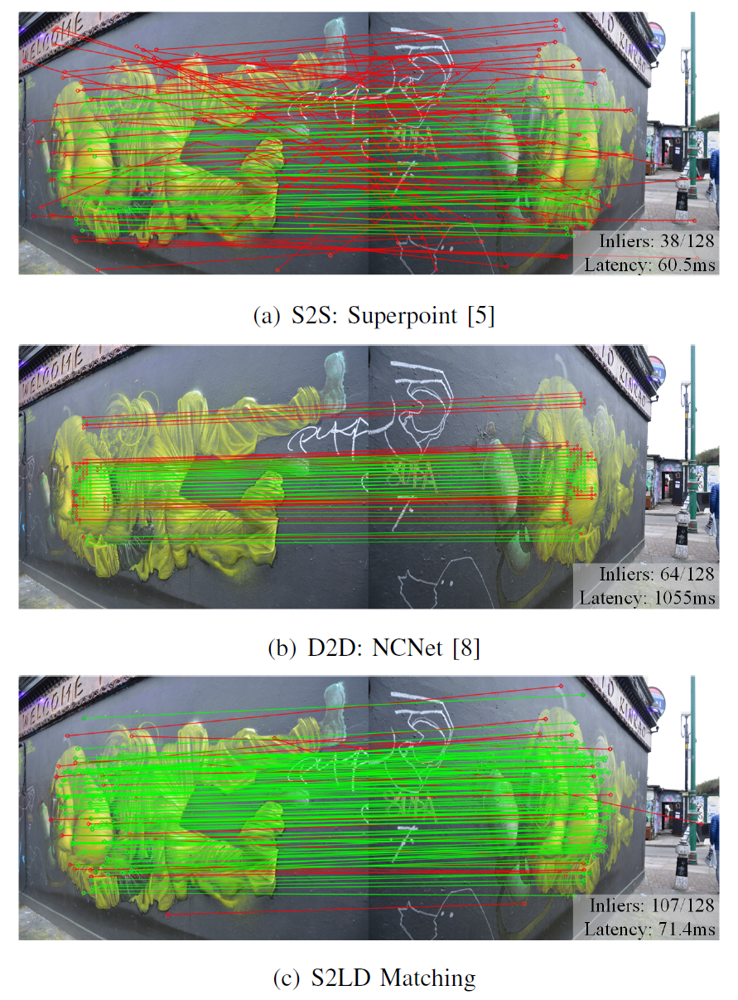

# S2LD: Sparse-to-Local-Dense Matching for Geometry-Guided Correspondence Estimation
### [Homepage](https://merical.github.io/) | [Paper](https://ieeexplore.ieee.org/document/10159656)
<br/>

This is a reimplemented end-to-end version of S2LD correspondence estimation described in the original paper.

> Sparse-to-Local-Dense Matching for Geometry-Guided Correspondence Estimation
> [Shenghao Li](https://merical.github.io), Qunfei Zhao<sup>\*</sup>, Zeyang Xia  
> IEEE Transaction on Image Processing, 2023



## Installation
```shell
# For full pytorch-lightning trainer features (recommended)
conda env create -f environment.yaml
conda activate s2ld
```

We provide the [download link](https://drive.google.com/drive/folders/1HwvPc3AzmjwxDsmBFIkWJmRdfF68_Hvw?usp=drive_link) to 
  - the megadepth-1500-testset.
  - The pretrained models of end2end S2LD.

## Run Demos

### Match image pairs

```shell
python demo_match.py --weight ./weights/s2ld-e2e-inference.pt
```

## Training

### Dataset Setup

Generally, MegaDepth is needed for training, the original dataset, the offline generated dataset indices. The dataset indices store scenes, image pairs, and other metadata within each dataset used for training/validation/testing. The relative poses between images used for training are directly cached in the indexing files. 

**Download the dataset indices**

You can download the required dataset indices from the [following link](https://drive.google.com/drive/folders/1HwvPc3AzmjwxDsmBFIkWJmRdfF68_Hvw?usp=drive_link).
After downloading, unzip the required files.
```shell
unzip downloaded-file.zip
# extract dataset indices
tar xf train-data/megadepth_indices.tar
# extract testing data (optional)
tar xf testdata/megadepth_test_1500.tar
```

**Build the dataset symlinks**

```shell
# megadepth
# -- # train and test dataset (train and test share the same dataset)
ln -s /path/to/megadepth/Undistorted_SfM /path/to/S2LD/data/megadepth/train
ln -s /path/to/megadepth/Undistorted_SfM /path/to/S2LD/data/megadepth/test
# -- # dataset indices
ln -s /path/to/megadepth_indices/* /path/to/S2LD/data/megadepth/index
```

### Training on MegaDepth

``` shell
scripts/train/train_outdoor_ds_e2e.sh
```

> NOTE: It uses 2 gpus only, with image sizes of 640x640. This is the reproduction of an end-to-end sparse-to-local-dense correspondence estimation, which may not be aligned to the results presented in the paper.

### Test on MegaDepth

``` shell
scripts/test/test_outdoor_ds_e2e.sh
```

For visualizing the results, please refer to `notebooks/visualize_dump_results.ipynb`.


## Citation

If you find this code useful for your research, please use the following BibTeX entry.

```bibtex
@ARTICLE{li2023s2ld,
  author={Li, Shenghao and Zhao, Qunfei and Xia, Zeyang},
  journal={IEEE Transactions on Image Processing}, 
  title={Sparse-to-Local-Dense Matching for Geometry-Guided Correspondence Estimation}, 
  year={2023},
  volume={32},
  number={},
  pages={3536-3551},
  doi={10.1109/TIP.2023.3287500}}
```